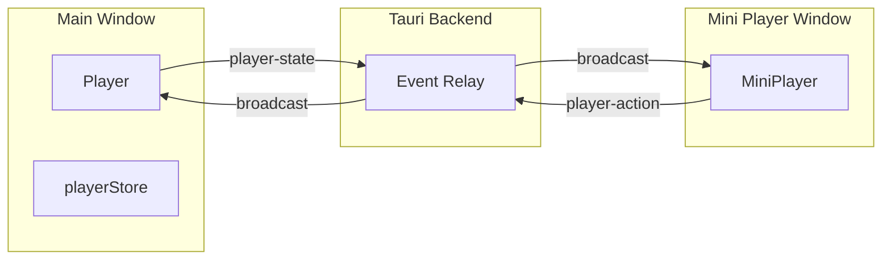

# Mini Player

Spotify-style floating mini player window for RecoDeck.

## Overview

The Mini Player is a separate window that displays the current track, playback controls, and progress bar. It stays in sync with the main player bar via Tauri events.

## Usage

1. **Open** — Click the PictureInPicture2 icon (picture-in-picture) in the player bar
2. **Close** — Click the X button in the mini player header
3. **Single instance** — Clicking the icon again focuses the existing window instead of opening a new one

## Features

- Album artwork (when available via `artwork_path`)
- Track title and artist
- Play / Pause, Previous, Next controls
- Seekable progress bar with time display
- Resizable window (~340×480 default)
- Always-on-top floating window

## Architecture

- **player-state** — Emitted by the main window when playback state changes; mini player listens and updates UI
- **player-action** — Emitted by mini player on user actions (play/pause, next, prev, seek); main window executes
- **request-player-state** — Emitted by mini player on mount; main window responds with current state

## Files

| File | Purpose |
|------|---------|
| `src/lib/miniPlayer.ts` | `openMiniPlayer()` — creates or focuses the window |
| `src/components/MiniPlayer.tsx` | Mini player UI and event handling |
| `src/components/MiniPlayer.css` | Styles |
| `src/components/Player.tsx` | Emits state, listens for actions, Mini Player button |
| `src-tauri/src/lib.rs` | Event relay (player-state, player-action, request-player-state) |

## Dependencies

- Core Tauri 2 API (`@tauri-apps/api/webviewWindow`) — Used to create and manage the mini player window
- Hash-based routing in `App.tsx` for `#mini-player` to render the mini player view
